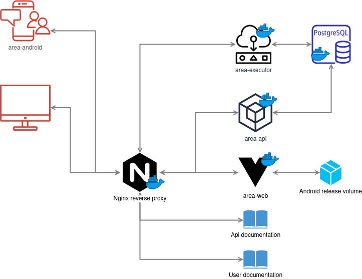

# Area

A web-based automation tool.


## Area overview




## Building and using with docker-compose

First build all dockerfile with:
```
docker-compose build
```

Then start all Area's service with:
```
docker-compose up
```
