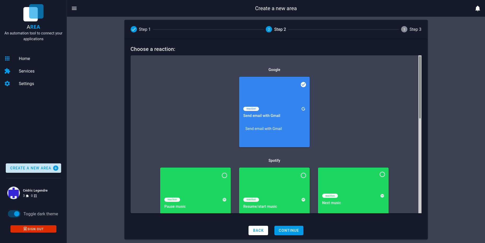
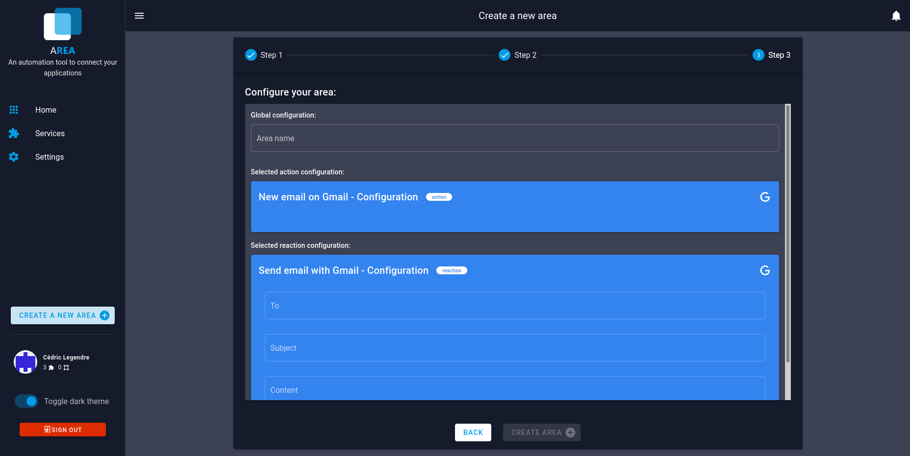

# Add an Area

## Step 1

First, you have to select an action for your area. Once you have choose, click on the button "Continue".

## Step 2

Now you have to select a reaction for you area. Once you have choose, click on the button "Continue".

## Step 3

The last step ask you to give a name to your Area. And for some actions (not all), it will be ask you to give one or more arguments. For example, for the action "Pause music", you have to give the name of your device in arguments.

Once you have fill all you have to fill, you can click on the button "Create Area"

