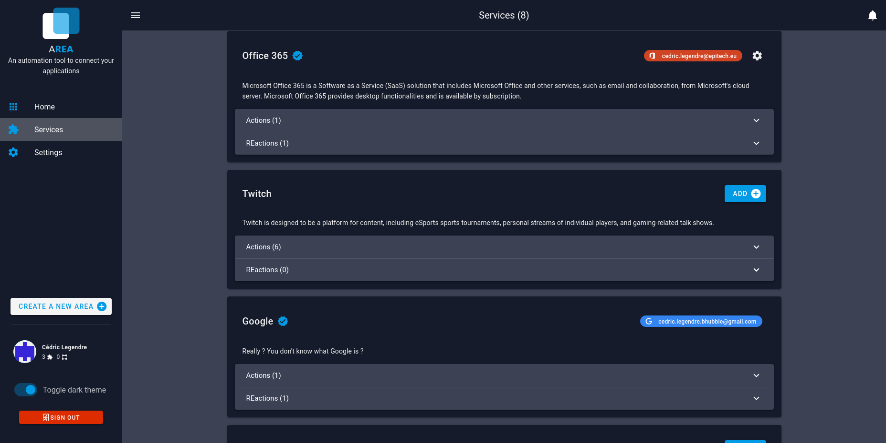

## Add a service

Add a service is very simple. You have to click one the blue "Add" button on the right of the service.

By clicking on this button, it will be ask you to connect to the selected service.

Once you are connected to a service, the blue "Add" button is replaced by your service's email and a gear.