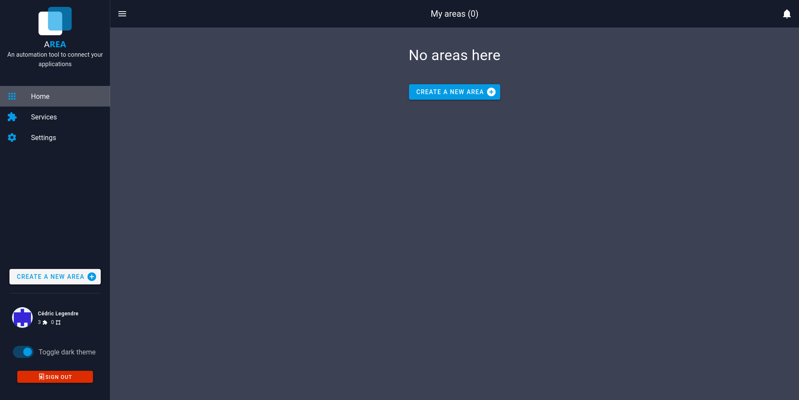

# Areas management

Once you have add all the services you are interested of, you have to create an Area. To create an Area, go to the Home page et click on the button "Create a new Area", or on the side bar.

