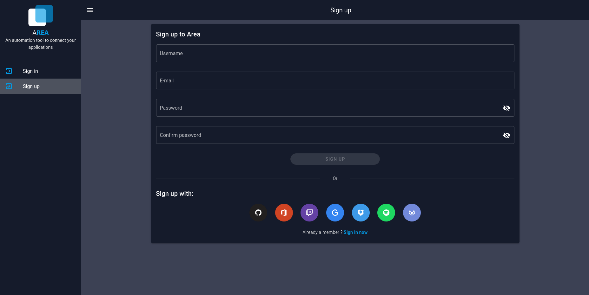
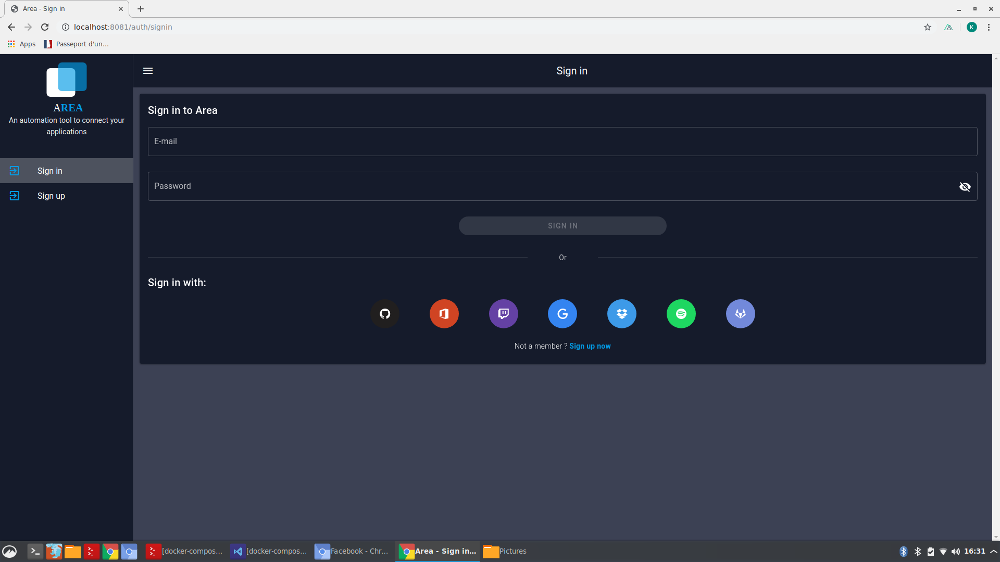

# Sign up / Sign In

When you launch the Area, you have to sign up or sign in. You can use a service like Spotify or Google, or with a register form.

## Sign up

You can register on the area by two ways. The first way is to fill the register form with a username (at least 5 characters), an email and a password.

The second way to register is to use an existing services which are proposed under the form. By clicking on the logo of a service, you can register to the area thanks to the clicked service's credentials.

## Sign in

If it's not the first time you come on our area, you can fill the sign in form with your email and your password.

Otherwise, you can connect to the area thanks to an existing service (As well as on the sign up page).