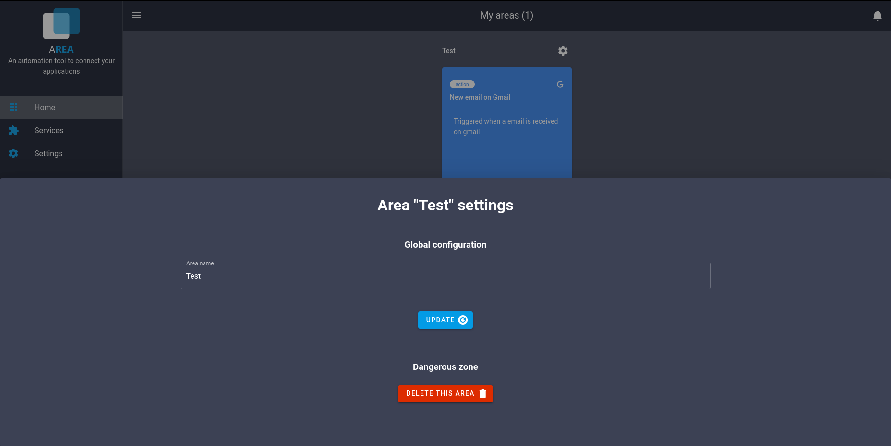

# Update/Delete Area

## Update Area

If you want, you can change the name of your Area by clicking on the gear button at the top of the area

Replace the name by an other, then, click on the button update.

## Delete Area

To suppress an Area, click on the gear button at the top-right of the Area.

Then, click on the red button "Delete this area".