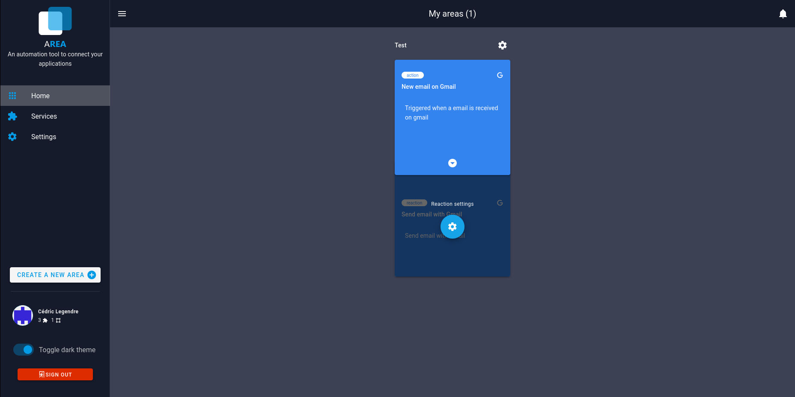
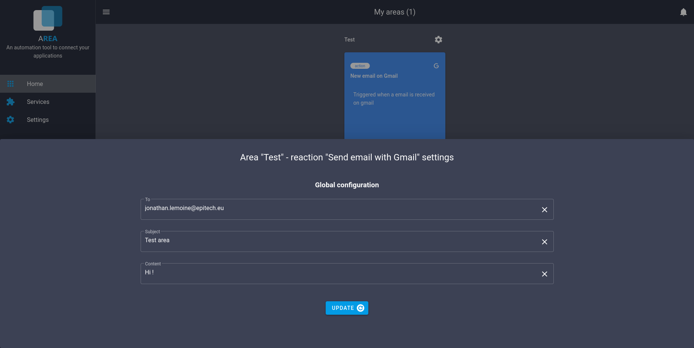

# Update parameter

If you have an action/reaction which require a parameter you can update it when you want. Just click on the action/reaction.

Once you have click on the action/reaction, you can modify the parameter and click on the "Update" button to save changes.

